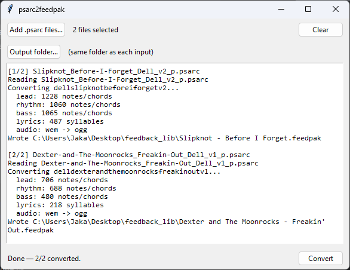

# psarc2feedpak

Turn your Rocksmith 2014 songs (`.psarc`) into
[feedpak](https://github.com/got-feedback/feedpak-spec) packages you can play in
[got-feedBack](https://github.com/got-feedback).



Notes, chords, slides, bends, lyrics, album art and audio all come across. The
chart is flattened to the full (hardest) difficulty.

## Getting started

1. Grab the installer from the
   [Releases](https://github.com/carelesshangman/psarc2feedpak/releases) page.
   It bundles everything you need (ffmpeg, vgmstream, no Python required).
2. Run it and open **psarc2feedpak** from the Start menu.
3. Click **Add .psarc files…** and pick your songs. You can select as many as
   you like.
4. Optionally click **Output folder…** to choose where the `.feedpak` files
   should go. By default each one lands next to its `.psarc`.
5. Hit **Convert** and watch the log. Each song prints its arrangements and
   note counts as it converts, so you can tell at a glance that everything
   made it through.

Each song becomes one `Artist - Title.feedpak` with all of its instruments
inside: lead, rhythm, bass, whatever the chart has. Drop the file into
got-feedBack and play.

A few things it handles that might not be obvious:

- **Compilation psarcs.** A file with several songs in it (like the Rocksmith 1
  import pack) comes out as one `.feedpak` per song, each with its own audio
  and cover art.
- **Doubled arrangements.** Some customs ship two "Lead" or two "Rhythm"
  charts. Both are kept, and the second shows up as "Lead 2".
- **Lyrics.** If the chart has a vocals track you get lyrics (and vocal pitch)
  in the package. If the charter didn't include one, there is nothing to
  convert.

## Command line

If you'd rather script it, install the package and run the module directly:

```
pip install construct cryptography
python -m psarc2feedpak song_p.psarc
python -m psarc2feedpak song_p.psarc -o out.feedpak
python -m psarc2feedpak song_p.psarc --keep-dir   # also leave the unzipped folder
```

Running from source, audio needs two external tools on your `PATH` (or drop
`vgmstream-cli` in `tools/vgmstream/`):

- [vgmstream](https://vgmstream.org/) decodes Wwise `.wem`
- [ffmpeg](https://ffmpeg.org/) does the OGG encode and DDS→PNG

The GUI is `python -m psarc2feedpak.gui`.

## Troubleshooting

- **"Heads up: … not found" in the log.** The app can't find ffmpeg or
  vgmstream, so charts convert but audio won't. Use the installer build (both
  are bundled) or put them on your `PATH`.
- **An instrument's highway is empty in got-feedBack.** Check the log for that
  song. Every arrangement should be listed with a sensible note count. If
  something is listed but doesn't play, open an issue (see below).
- **No lyrics.** The source chart has no vocals track. This is common for older
  customs and Rocksmith 1 imports.

## Reporting problems

Found a file that converts wrong? Please open an
[issue](https://github.com/carelesshangman/psarc2feedpak/issues) and include:

1. **What you expected and what you got instead.** "Rhythm highway is empty"
   beats "it doesn't work".
2. **The log.** Select the text in the app's log window (or copy the command
   line output) and paste the whole thing. The per-arrangement note counts in
   there usually point straight at the problem.
3. **The psarc's exact filename** and where it came from (official DLC,
   CustomsForge, a Rocksmith 1 import, and so on). If you can share the file
   itself, even better.
4. **Your version**: which release you installed, and your OS.

Please don't paste screenshots of text. Actual text is searchable and much
easier to read.

## Legal

The AES keys required to read a `.psarc` are the fixed keys Rocksmith 2014 ships
with, the same ones every open-source RS tool has used for a decade. This is a
tool for converting songs you already own for personal use.

This project is independent and is **not affiliated with, endorsed by, or
associated with any of the businesses, products, or projects it interoperates
with**, including Ubisoft / Rocksmith, got-feedBack, ffmpeg, or vgmstream. All
trademarks belong to their respective owners. The prebuilt releases bundle
ffmpeg (GPL) and vgmstream (see their licenses in the download).

## Credits

PSARC/SNG parsing follows the community reverse-engineering work in
[0x0L/rocksmith](https://github.com/0x0L/rocksmith) and the
[Rocksmith Custom Song Toolkit](https://github.com/rscustom/rocksmith-custom-song-toolkit).

Thanks to everyone who reports issues with real-world files. That's how the
weird ones get fixed.

## License

MIT
